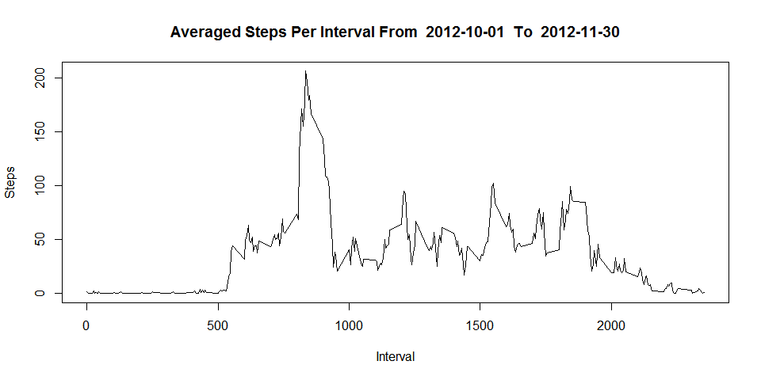

# Reproducible Research Peer-graded Assignment: Course Project 1
Kevin McCue  
July 17, 2017  


## Loading and preprocessing the data
##
##
##1.1 Downloading and loading the full dataset


##1.2 Setting up all the data for analysis

```r
data$dayofweek <- weekdays(as.Date(data$date))
averagestepsperdayofwk <- aggregate(steps ~ weekdays(as.Date(date)), data = data, FUN = mean)
colnames(averagestepsperdayofwk)[which(names(averagestepsperdayofwk) == "weekdays(as.Date(date))")] <- "dayofweek"
sdstepsperdayofwk <- aggregate(steps ~ weekdays(as.Date(date)), data = data, FUN = sd)
colnames(sdstepsperdayofwk)[which(names(sdstepsperdayofwk) == "weekdays(as.Date(date))")] <- "dayofweek"
averagestepsperint <- aggregate(steps ~ interval, data = data, FUN = mean)
sdstepsperdayofint <- aggregate(steps ~ interval, data = data, FUN = sd)
steps.date <- aggregate(steps ~ date, data = data, FUN = sum)
```

##2.  Bar Plot of Number of Steps Per Day

```r
barplot(steps.date$steps, names.arg = steps.date$date, 
        xlab = "Date", 
        ylab = "Step Count", 
        main = paste("Steps per Day From ", min(as.Date(data$date)), " To ", max(as.Date(data$date))))
```


##
##


## What is mean total number of steps taken per day?

## 3.1 The mean number of steps per day:

```r
 mean(steps.date$steps)
```

```
## [1] 10766.19
```

## 3.2 The median number of steps per day:

```r
median(steps.date$steps)
```

```
## [1] 10765
```

## What is the average daily activity pattern?


##4.  Time series plot of the average number of steps taken


```r
plot(averagestepsperint, type = "l", 
     xlab= "Interval", 
     ylab = "Steps", 
     main = paste("Averaged Steps Per Interval From ", min(as.Date(data$date)), " To ", max(as.Date(data$date))))
```



##5.  The 5-minute interval that, on average, contains the maximum number of steps

```r
averagestepsperint$interval[which.max(averagestepsperint$steps)]
```

```
## [1] 835
```


## Imputing missing values

##6.  Code to describe and show a strategy for imputing missing data

```r
sum(is.na(data))
```

```
## [1] 2304
```

```r
data <- merge(data, averagestepsperint, by = "interval", suffixes = c("", ".y"))
nas <- is.na(data$steps)
data$steps[nas] <- data$steps.y[nas]
data <- data[, c(1:3)]
sum(is.na(data))
```

```
## [1] 0
```

##7.  Histogram of the total number of steps taken each day after missing values are imputed

```r
hist(steps.date$steps, 
        xlab = "Date", breaks = 20, 
     col = "grey",
        ylab = "Step Count", 
        main = paste("Total Number of Steps Taken Each Day Steps per Day From ", min(as.Date(data$date)), " To ", max(as.Date(data$date))))
```


## Are there differences in activity patterns between weekdays and weekends?

##8.  Panel plot comparing the average number of steps taken per 5-minute interval across weekdays and weekends

```r
daytype <- function(date) {
  if (weekdays(as.Date(date)) %in% c("Saturday", "Sunday")) {
    "weekend"} else {"weekday"}
}
data$daytype <- as.factor(sapply(data$date, daytype))
par(mfrow = c(2, 1))
for (type in c("weekend", "weekday")) {
  steps.type <- aggregate(steps ~ interval, data = data, subset = data$daytype == 
                            type, FUN = mean)
  plot(steps.type, type = "l", main = type, xlab= "Interval", 
       ylab = "Steps" )
}
```


